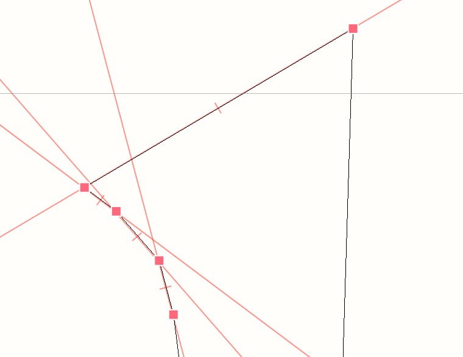

# Add-segment-guideline
- select a segment, and run the extension. 
- By default it is on `cmd + /` shortcut, if you wish to remove them press `ctrl + /`. It will only remove the guideliens that had been added by this extension.
- works only with straight lines only if multiple selection
- can add guideline on offcurve point
- can add guideline between two independent points, like two offcurve points for example
## plans
- add right click contextual menu for adding guideline - for mouse users
- add possibility to mirror a guideline in contextual menu
## verions
- 0.2 - added possibility of adding guideline on offcurve points or two independent points (combination of on curve and offcurve possible). Fixed bug, all angles are `x:x % 180`
- 0.1 - basic functionality, adding guideline on straight lines only

